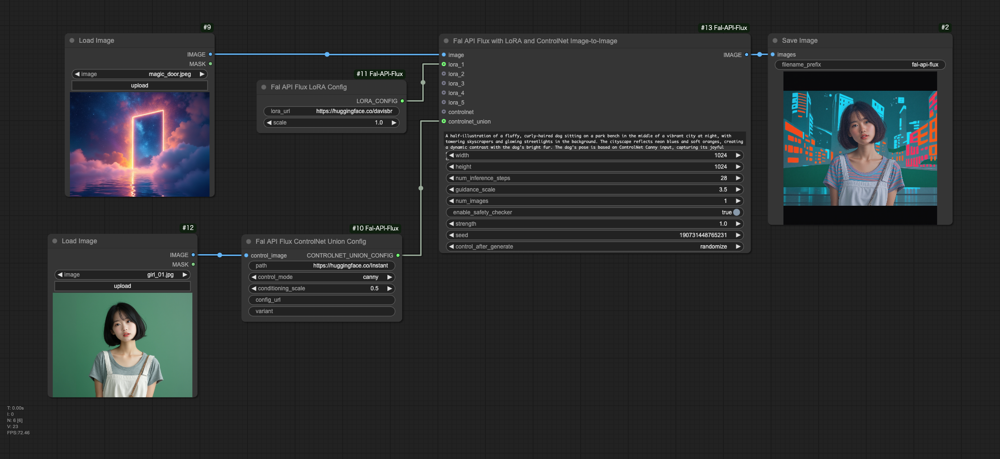

# ComfyUI-Fal-API-Flux



This repository contains custom nodes for ComfyUI that integrate the fal.ai FLUX.1 APIs for text-to-image and image-to-image generation. These nodes allow you to use the FLUX.1 models directly within your ComfyUI workflows.

## Features

- Text-to-image generation using fal.ai's FLUX.1 [dev] and FLUX.1 [pro] models
- Image-to-image generation using FLUX.1 [dev] model
- Support for LoRA models
- ControlNet and ControlNet Union support
- Customizable generation parameters (image size, inference steps, guidance scale)
- Multiple image generation in a single request
- Seed support for reproducible results
- Safety tolerance settings for FLUX.1 [pro]

## Prerequisites

- ComfyUI installed and set up
- Python 3.7+
- PyTorch 2.0.1 or later
- A fal.ai API key with access to the FLUX.1 models

## Installation

There are two ways to install ComfyUI-Fal-API-Flux:

### Method 1: Using ComfyUI Manager (Recommended)

1. Install [ComfyUI Manager](https://github.com/ltdrdata/ComfyUI-Manager) if you haven't already.
2. Open ComfyUI and navigate to the "Manager" tab.
3. Search for "ComfyUI-Fal-API-Flux" in the custom nodes section.
4. Click "Install" to automatically download and install the custom nodes.

### Method 2: Manual Installation

1. Clone this repository into your ComfyUI's `custom_nodes` directory:
   ```
   cd /path/to/ComfyUI/custom_nodes
   git clone https://github.com/your-username/ComfyUI-Fal-API-Flux.git
   ```
2. Navigate to the cloned directory:
   ```
   cd ComfyUI-Fal-API-Flux
   ```
3. Install the required dependencies:
   ```
   pip install -r requirements.txt
   ```

After installation using either method:

4. Configure your API key (see Configuration section below)
5. Restart ComfyUI if it's already running

## Configuration

To use these custom nodes, you need to set up your fal.ai API key:

1. Create a `config.ini` file in the root directory of the project.
2. Add the following content to `config.ini`:
   ```ini
   [falai]
   api_key = your_api_key_here
   ```
3. Replace `your_api_key_here` with your actual fal.ai API key.
4. Save the file.

Keep your `config.ini` file secure and do not share it publicly.

## Usage

After installation, you'll find the following new nodes in the ComfyUI interface:

1. "Fal API Flux Dev": The main node for text-to-image generation using FLUX.1 [dev].
2. "Fal API Flux Dev Image-to-Image": A node for image-to-image generation using FLUX.1 [dev].
3. "Fal API Flux Dev with LoRA": A node for text-to-image generation using FLUX.1 [dev] with LoRA support.
4. "Fal API Flux Dev with LoRA Image-to-Image": A node for image-to-image generation using FLUX.1 [dev] with LoRA support.
5. "Fal API Flux with LoRA and ControlNet": A node for text-to-image generation using FLUX.1 [dev] with LoRA and ControlNet support.
6. "Fal API Flux with LoRA and ControlNet Image-to-Image": A node for image-to-image generation using FLUX.1 [dev] with LoRA and ControlNet support.
7. "Fal API Flux Pro": A node for text-to-image generation using FLUX.1 [pro].
8. "Fal API Flux LoRA Config": A node for configuring LoRA models.
9. "Fal API Flux ControlNet Config": A node for configuring ControlNet.
10. "Fal API Flux ControlNet Union Config": A node for configuring ControlNet Union.

### Basic Usage

1. Add one of the Fal API Flux nodes to your workflow.
2. Configure the node parameters (prompt, image size, etc.).
3. Connect the output to a "Preview Image" or "Save Image" node to see the results.

### Using LoRA

1. Add a "Fal API Flux LoRA Config" node to your workflow.
2. Configure the LoRA URL and scale.
3. Connect the output of the LoRA Config node to the `lora` input of a compatible Fal API Flux node.

### Using ControlNet

1. Add a "Fal API Flux ControlNet Config" or "Fal API Flux ControlNet Union Config" node to your workflow.
2. Configure the ControlNet parameters.
3. Connect the output to the `controlnet` or `controlnet_union` input of a compatible Fal API Flux node.

### Image-to-Image Generation

1. Use a ComfyUI image loader node to load an input image.
2. Connect the loaded image to an image-to-image node (e.g., "Fal API Flux Dev Image-to-Image").
3. Configure the node parameters, including the strength of the transformation.

## Example Workflows

Example workflows are provided in the `examples` folder of this repository. To use them:

1. Locate the desired workflow image in the `examples` folder.
2. Open ComfyUI in your web browser.
3. Drag and drop the workflow image directly onto the ComfyUI canvas.

These example workflows provide starting points for using the Fal API Flux nodes in your own projects.

## Troubleshooting

If you encounter issues:

1. Ensure you have access to the FLUX.1 models on fal.ai.
2. Check the ComfyUI console for detailed error messages and logs.
3. Verify that your API key is correctly set in the `config.ini` file.
4. Make sure your LoRA URL is correct and compatible with FLUX.1 [dev].
5. For persistent issues, enable debug logging and check the logs for API responses and image processing details.

## Contributing

Contributions to improve the nodes or extend their functionality are welcome! Please feel free to submit issues or pull requests.

## License

This project is licensed under the MIT License - see the [LICENSE](LICENSE) file for details.

## Acknowledgements

- [fal.ai](https://fal.ai) for providing the FLUX.1 APIs
- [ComfyUI](https://github.com/comfyanonymous/ComfyUI) for the extensible UI framework

## Disclaimer

This project is not officially affiliated with or endorsed by fal.ai or ComfyUI. Use it at your own risk and be sure to comply with fal.ai's terms of service when using their API.